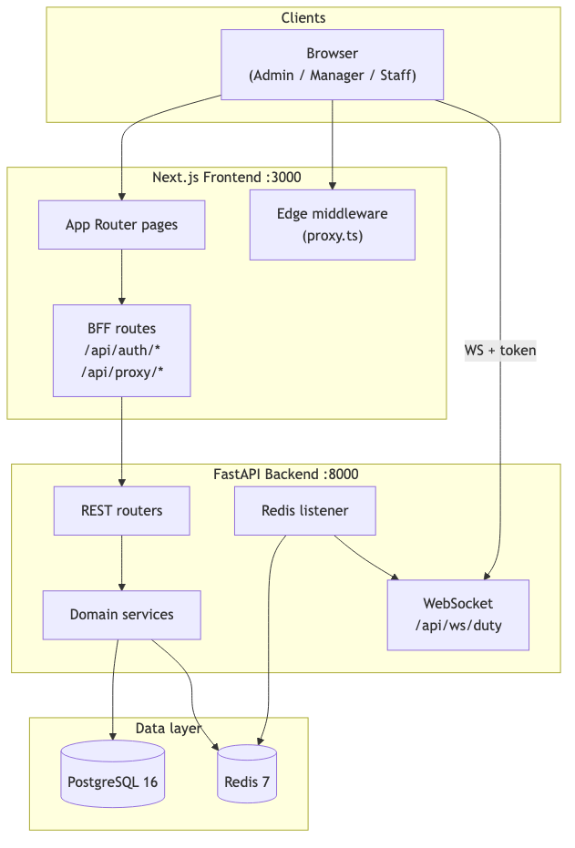
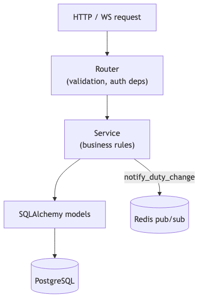
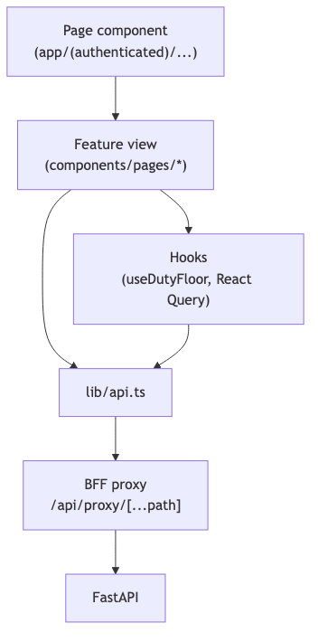
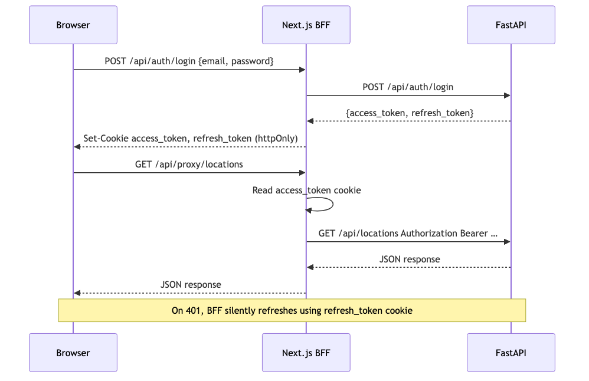
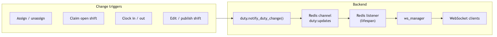
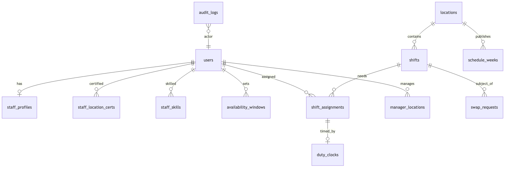
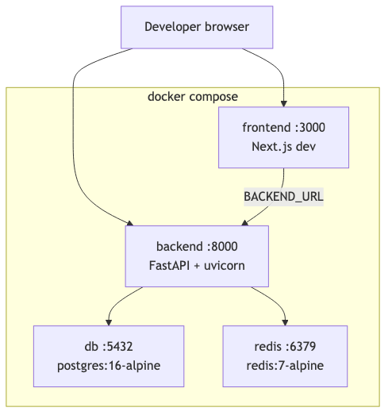

# Architecture

## 1. System context

ShiftSync is a three-tier web application: a Next.js frontend, a FastAPI backend, and PostgreSQL for persistence. Redis provides pub/sub for live floor broadcasts across backend workers.



---

## 2. Repository layout

```
soft/
├── backend/
│   ├── app/
│   │   ├── main.py              # FastAPI app, router registration, lifespan
│   │   ├── config.py            # Settings (DATABASE_URL, REDIS_URL, SECRET_KEY)
│   │   ├── database.py          # Async SQLAlchemy engine + session
│   │   ├── dependencies.py      # get_current_user, require_roles
│   │   ├── security.py          # JWT, bcrypt
│   │   ├── models/              # SQLAlchemy ORM models
│   │   ├── schemas/             # Pydantic request/response models
│   │   ├── routers/             # HTTP + WebSocket route handlers
│   │   └── services/            # Business logic
│   ├── alembic/                 # Database migrations
│   └── scripts/seed.py          # Demo data loader
├── frontend/
│   ├── app/                     # Next.js App Router
│   │   ├── (authenticated)/     # Protected pages
│   │   └── api/                 # BFF auth + proxy routes
│   ├── components/
│   │   ├── pages/               # Feature views (ScheduleView, OnDutyView, …)
│   │   ├── charts/              # Recharts wrappers + drill panels
│   │   └── layout/              # Sidebar, TopNav, nav-config
│   ├── hooks/                   # useDutyFloor, useDutySummary
│   ├── lib/                     # api.ts, auth-cookies, ws.ts, live-query
│   └── providers/               # AuthProvider, QueryProvider
├── docs/                        # This documentation
└── docker-compose.yml           # db, redis, backend, frontend
```

---

## 3. Backend layers



### 3.1 Routers

| Router | Prefix | Responsibility |
| --- | --- | --- |
| `auth.py` | `/api/auth` | Login, refresh, current user |
| `locations.py` | `/api/locations` | Location list, overview, manager assignment |
| `staff.py` | `/api/staff` | Staff CRUD, export |
| `scheduling.py` | `/api` | Shifts, assignments, publish, per-shift history |
| `availability.py` | `/api` | Staff availability, my shifts |
| `swaps.py` | `/api` | Swap requests, open shifts, claim |
| `notifications.py` | `/api` | In-app notifications, preferences |
| `duty.py` | `/api/duty` | Floor snapshot, summary, clock in/out, WS token |
| `audit.py` | `/api/audit` | Cross-location audit list |
| `ws.py` | `/api/ws` | WebSocket duty stream |

### 3.2 Services

| Service | File | Responsibility |
| --- | --- | --- |
| Access control | `services/access.py` | Location scoping for admin/manager |
| Constraints | `services/constraints.py` | Assignment validation + suggestions |
| Concurrency | `services/concurrency.py` | `SELECT … FOR UPDATE` on shifts/swaps |
| Swaps | `services/swaps.py` | Swap/drop/claim state machine |
| Duty | `services/duty.py` | Floor snapshot, clock logic, break timer |
| Redis bus | `services/redis_bus.py` | Publish/subscribe on `duty:updates` |
| WS manager | `services/ws_manager.py` | Connected clients, snapshot broadcast |
| Audit | `services/audit.py` | Write audit log entries |
| Audit list | `services/audit_list.py` | Enriched cross-location audit queries |
| Notifications | `services/notifications.py` | In-app + simulated email |

---

## 4. Frontend layers



### 4.1 Authentication flow (BFF)

The browser never stores JWTs in JavaScript. All API calls go through the Next.js BFF, which reads httpOnly cookies and attaches the Bearer token.



Key files:

| File | Role |
| --- | --- |
| `frontend/app/api/auth/login/route.ts` | Login → set cookies |
| `frontend/app/api/proxy/[...path]/route.ts` | Proxy + token refresh |
| `frontend/lib/auth-cookies.ts` | Cookie names and options |
| `frontend/proxy.ts` | Edge middleware: auth redirect, role routing |
| `frontend/providers/AuthProvider.tsx` | Client session state |

### 4.2 Live data strategy

| Data | Mechanism | Interval |
| --- | --- | --- |
| Open shifts, swaps, notifications, duty summary | TanStack Query polling | 30 seconds |
| Schedule, my schedule | TanStack Query polling | 60 seconds |
| Live floor (managers) | WebSocket primary, REST bootstrap | Push + reconnect |
| My Schedule duty timers (staff) | Polling while shift active | 10 seconds |

Configuration: `frontend/lib/live-query.ts`

---

## 5. Live floor architecture



WebSocket authentication uses a **short-lived WS JWT** (5 minutes, `type: ws`) obtained from `POST /api/duty/ws-token`. Only admin and manager roles may connect.

Client flow (`frontend/hooks/useDutyFloor.ts`):

1. Fetch initial snapshot via `GET /api/duty/floor`
2. Obtain WS token
3. Connect to `ws://host/api/ws/duty?token=…`
4. Receive `{ type: "snapshot", data: DutyFloorResponse }` on each update
5. Ping every 25s; reconnect after 3–5s on disconnect

---

## 6. Database schema (summary)

Migrations: `backend/alembic/versions/001_initial.py`, `002_swap_shift_id.py`, `003_duty_clock.py`



Full column definitions are in the SQLAlchemy models under `backend/app/models/`.

---

## 7. Deployment topology (Docker Compose)



Backend startup sequence (see `docker-compose.yml`):

1. Wait for PostgreSQL and Redis health checks
2. `alembic upgrade head`
3. `python -m scripts.seed` (+ scheduling, swaps, duty)
4. `uvicorn app.main:app --reload`

---

## 8. Health and observability

| Endpoint | Response |
| --- | --- |
| `GET /health` | `{ status: "ok" \| "degraded", redis: "up" \| "down" }` |

Redis availability determines health status. PostgreSQL is not checked on this endpoint.

OpenAPI documentation is auto-generated at `/docs` when the backend is running.
