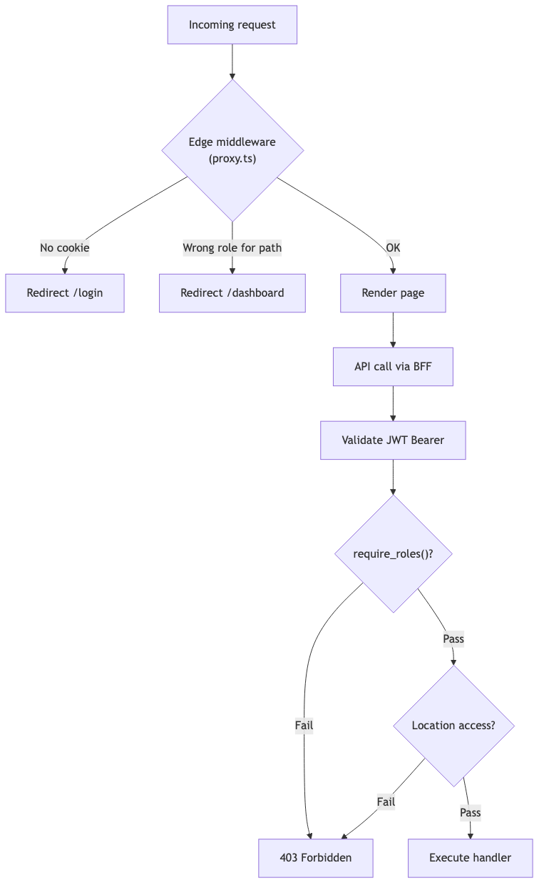

# Role Permissions

ShiftSync defines three roles: **admin**, **manager**, and **staff**. Authorization is enforced at two layers:

1. **Edge middleware** — `frontend/proxy.ts` reads JWT from httpOnly cookie and checks `ROLE_ROUTES`
2. **API** — `require_roles()` and `require_location_access()` on FastAPI endpoints

Legend: `[x]` = allowed, `[ ]` = not allowed

---

## Route access matrix

| Route | Admin | Manager | Staff |
| --- | --- | --- | --- |
| `/dashboard` | [x] | [x] | [x] |
| `/schedule` | [x] | [x] | [ ] |
| `/on-duty` | [x] | [x] | [ ] |
| `/open-shifts` | [x] | [x] | [x] |
| `/audit` | [x] | [x] | [ ] |
| `/users` | [x] | [ ] | [ ] |
| `/locations` | [x] | [ ] | [ ] |
| `/my-schedule` | [ ] | [ ] | [x] |
| `/availability` | [ ] | [ ] | [x] |
| `/settings` | [x] | [x] | [x] |
| `/profile` | [x] | [x] | [x] |

All authenticated users land on `/dashboard` after login (`homePathForRole`).

Nav items are filtered by role in `frontend/components/layout/nav-config.ts`.

---

## Location scope

| Role | Visible locations | Mechanism |
| --- | --- | --- |
| Admin | All four sites | `get_accessible_location_ids()` returns `None` |
| Manager | Assigned sites only | `manager_locations` join table |
| Staff | Certified sites (for assignment rules) | `staff_location_certs` |

Managers west: Pier House, Harbor Grill  
Managers east: Boardwalk Bistro, Lighthouse Cafe

---

## API capability matrix

### Locations

| Endpoint | Admin | Manager | Staff |
| --- | --- | --- | --- |
| `GET /locations` | [x] all | [x] assigned | [ ] |
| `GET /locations/overview` | [x] | [ ] | [ ] |
| `PUT /locations/{id}/managers` | [x] | [ ] | [ ] |

### Staff roster

| Endpoint | Admin | Manager | Staff |
| --- | --- | --- | --- |
| `GET /staff` | [x] | [x] | [ ] |
| `GET /staff/export` | [x] | [x] | [ ] |
| `POST /staff` | [x] | [ ] | [ ] |
| `PATCH /staff/{id}` | [x] | [ ] | [ ] |
| `DELETE /staff/{id}` | [x] | [ ] | [ ] |

### Scheduling

| Endpoint | Admin | Manager | Staff |
| --- | --- | --- | --- |
| `GET /locations/{id}/schedule` | [x] | [x] scoped | [x] published only |
| `POST /locations/{id}/shifts` | [x] | [x] scoped | [ ] |
| `PATCH /shifts/{id}` | [x] | [x] scoped | [ ] |
| `DELETE /shifts/{id}` | [x] | [x] scoped | [ ] |
| `POST /shifts/{id}/assign` | [x] | [x] scoped | [ ] |
| `POST …/publish` / `unpublish` | [x] | [x] scoped | [ ] |
| `GET /shifts/{id}/history` | [x] | [x] scoped | [ ] |

**Admin-only override:** Assign to published shifts within the 48-hour cutoff window.

### My schedule and availability

| Endpoint | Admin | Manager | Staff |
| --- | --- | --- | --- |
| `GET /my/shifts` | [ ] | [ ] | [x] |
| `GET /me/availability` | [ ] | [ ] | [x] |
| `PUT /me/availability` | [ ] | [ ] | [x] |

### Swaps and open shifts

| Endpoint | Admin | Manager | Staff |
| --- | --- | --- | --- |
| `GET /swap-requests` | [x] all scoped | [x] scoped | [x] own + actionable |
| `GET /open-shifts` | [x] | [x] | [x] |
| `POST /swap-requests` | [ ] | [ ] | [x] |
| `POST …/accept` | [ ] | [ ] | [x] target peer |
| `POST …/approve` | [x] scoped | [x] scoped | [ ] |
| `POST …/cancel` | [x] | [x] | [x] own requests |
| `POST …/claim` | [ ] | [ ] | [x] |

### Duty and live floor

| Endpoint | Admin | Manager | Staff |
| --- | --- | --- | --- |
| `GET /duty/floor` | [x] | [x] | [ ] |
| `GET /duty/summary` | [x] | [x] | [ ] |
| `POST /duty/ws-token` | [x] | [x] | [ ] |
| `WS /ws/duty` | [x] | [x] | [ ] |
| `POST /duty/clock-in` | [x] any at accessible location | [x] scoped | [x] own assignment |
| `POST /duty/clock-out` | [x] | [x] scoped | [x] own assignment |

Staff see duty status and timers on `GET /my/shifts` (embedded `duty` object), not via the Live Floor page.

### Audit

| Endpoint | Admin | Manager | Staff |
| --- | --- | --- | --- |
| `GET /audit` | [x] all locations | [x] scoped | [ ] |
| Per-shift history in drawer | [x] | [x] scoped | [ ] |

### Notifications

| Endpoint | Admin | Manager | Staff |
| --- | --- | --- | --- |
| `GET /me/notifications` | [x] | [x] | [x] |
| `PATCH /me/notification-preferences` | [x] | [x] | [x] |

---

## UI capabilities by role

### Admin

- [x] Corporate dashboard with network-wide charts and location cards
- [x] Staff roster CRUD and CSV export
- [x] Assign managers to locations
- [x] Full scheduling at any location
- [x] Live floor across all sites
- [x] Cross-location audit log
- [x] Override published-shift cutoff on assignment

### Manager

- [x] Operations dashboard with location tabs and drill-down charts
- [x] Weekly schedule: create, edit, assign, publish at assigned locations
- [x] Live floor with WebSocket updates
- [x] Approve swaps and drops
- [x] View open shifts pool
- [ ] Claim open shifts (managers are not the staff role)
- [x] Audit log for accessible locations
- [x] Clock staff in/out at accessible locations

### Staff

- [x] Personal dashboard: hours, upcoming shifts, open pool count
- [x] My Schedule: view published shifts, clock in/out, request swap/drop
- [x] Availability editor with timezone and exceptions
- [x] Open shifts pool: claim eligible drops
- [x] Accept incoming swap requests from peers
- [ ] Live Floor page
- [ ] Staff roster or location administration

---

## Permission enforcement diagram

