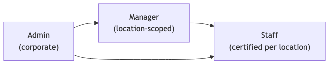
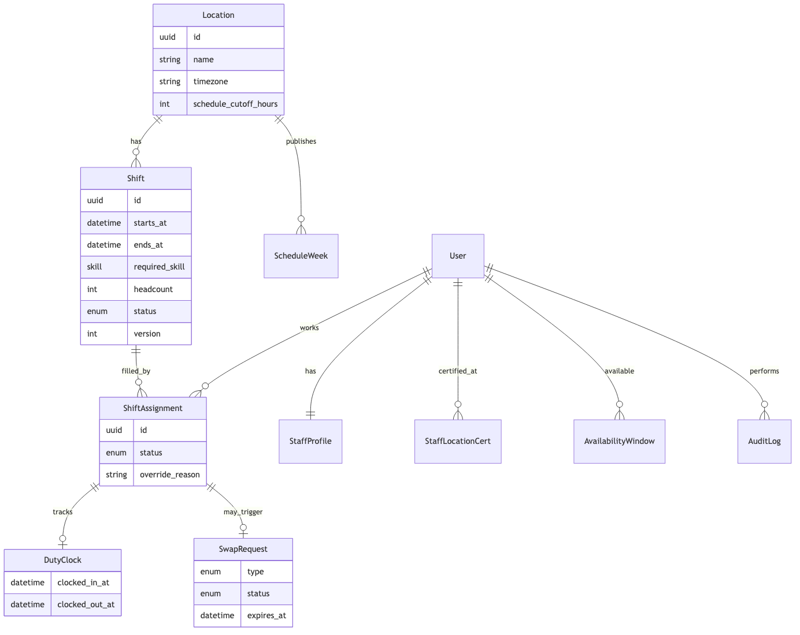

# Project Specification

## 1. Overview

### 1.1 Purpose

ShiftSync enables Coastal Eats to plan weekly staff schedules across multiple restaurant locations, publish shifts to staff, handle swap and drop requests, track who is on duty in real time, and maintain an audit trail of scheduling changes.

### 1.2 Business context

Coastal Eats operates four locations with different time zones and manager territories:

| Location | Timezone | Typical manager |
| --- | --- | --- |
| Pier House | America/Los_Angeles | manager.west@coastaleats.com |
| Harbor Grill | America/Los_Angeles | manager.west@coastaleats.com |
| Boardwalk Bistro | America/New_York | manager.east@coastaleats.com |
| Lighthouse Cafe | America/New_York | manager.east@coastaleats.com |

Corporate administrators oversee all sites. Staff are certified for one or more locations and hold role skills (server, bartender, line cook, host).

### 1.3 Actors

| Actor | Primary goals |
| --- | --- |
| **Admin** | Network-wide visibility, staff roster, location manager assignment, corporate reporting |
| **Manager** | Build and publish weekly schedules, assign staff, approve swaps/drops, monitor live floor |
| **Staff** | View schedule, set availability, request swaps/drops, claim open shifts, clock in/out |

---

## 2. Domain model

### 2.1 Core entities

### 2.2 Enumerations

| Enum | Values | Usage |
| --- | --- | --- |
| `user_role` | admin, manager, staff | Authorization |
| `skill` | bartender, line_cook, server, host | Shift requirements |
| `shift_status` | draft, published | Visibility to staff |
| `assignment_status` | assigned, pending_swap | Locked while swap pending |
| `swap_type` | swap, drop | Peer exchange vs open pool release |
| `swap_status` | pending_counterparty, pending_manager, approved, cancelled, expired, superseded | Request lifecycle |

### 2.3 Time handling

- All shift timestamps are stored in **UTC** in PostgreSQL.
- UI displays times in each **location's timezone** (`locations.timezone`).
- Shift create/edit accepts **local date + local start/end times**; the backend converts using `zoneinfo`.
- Availability windows are stored per staff member with their chosen **availability timezone**.

---

## 3. Functional requirements

### 3.1 Authentication and authorization

- [x] **AUTH-1** — Users authenticate with email and password
- [x] **AUTH-2** — Sessions use JWT access tokens (short-lived) and refresh tokens (long-lived)
- [x] **AUTH-3** — Tokens are stored in httpOnly cookies via a Next.js BFF; the browser never holds raw tokens in JS
- [x] **AUTH-4** — Routes are gated by role at the edge middleware and again on the API
- [x] **AUTH-5** — Managers are scoped to locations in `manager_locations`; admins see all locations

### 3.2 Staff roster (admin)

- [x] **ROSTER-1** — Create, read, update, delete staff accounts
- [x] **ROSTER-2** — Assign skills, location certifications, desired hours, availability timezone
- [x] **ROSTER-3** — Export staff list as CSV
- [x] **ROSTER-4** — Managers may list staff (read-only) but cannot create or delete

### 3.3 Weekly scheduling

- [x] **SCHED-1** — Managers/admins create shifts with skill, headcount, date, and local times
- [x] **SCHED-2** — Shifts belong to a location and a calendar week (Monday start)
- [x] **SCHED-3** — Assign staff to shifts with constraint validation
- [x] **SCHED-4** — Preview assignment violations before committing
- [x] **SCHED-5** — Publish a week to make shifts visible to staff
- [x] **SCHED-6** — Unpublish reverts shifts to draft
- [x] **SCHED-7** — Edit filled shifts (times, skill, headcount); headcount cannot drop below current assignments
- [x] **SCHED-8** — Optimistic concurrency on shift edits via `version` field
- [x] **SCHED-9** — Row-level locking on assign and claim to prevent double-booking

### 3.4 Assignment constraints

**Errors (blocking)**

- [x] **CON-1** — Staff must be certified at the location
- [x] **CON-2** — Staff must have required skill
- [x] **CON-3** — Shift must fall within availability (windows + exceptions)
- [x] **CON-4** — No overlapping shifts
- [x] **CON-5** — Minimum 10-hour rest between adjacent shifts
- [x] **CON-6** — Max 12 hours in a calendar day (location timezone)
- [x] **CON-7** — 7th consecutive work day requires override reason
- [x] **CON-8** — Published shift within cutoff window (default 48h) — admin override only
- [x] **CON-9** — Max 3 pending swap requests per staff

**Warnings (non-blocking)**

- [x] **CON-10** — Daily 8h+, weekly 35h+, weekly 40h+, 6th consecutive day

### 3.5 Swaps and open shifts

- [x] **SWAP-1** — Staff may request a swap with a specific peer or a drop to the open pool
- [x] **SWAP-2** — Swap requires peer acceptance before manager approval
- [x] **SWAP-3** — Drop goes directly to manager approval
- [x] **SWAP-4** — Approved drops appear in the open shifts pool for eligible staff to claim
- [x] **SWAP-5** — Claim validates the same constraints as assignment
- [x] **SWAP-6** — Editing a shift supersedes pending swap requests on that shift

### 3.6 Availability (staff)

- [x] **AVAIL-1** — Staff set recurring weekly windows (day + start/end time)
- [x] **AVAIL-2** — Staff set date-specific exceptions (unavailable or custom hours)
- [x] **AVAIL-3** — Staff choose their availability timezone

### 3.7 Live floor and duty

- [x] **DUTY-1** — Managers/admins see a live floor view: who is scheduled, clocked in, tardy, or missing
- [x] **DUTY-2** — Staff clock in/out from My Schedule for their own assignments
- [x] **DUTY-3** — Managers/admins may clock staff in/out at accessible locations
- [x] **DUTY-4** — Tardy = no clock-in more than 5 minutes after shift start
- [x] **DUTY-5** — Early clock-in allowed up to 15 minutes before shift start
- [x] **DUTY-6** — Break due indicator after 4 hours on shift (computed, not persisted)
- [x] **DUTY-7** — Live updates pushed via WebSocket to manager/admin clients
- [x] **DUTY-8** — Redis pub/sub notifies all backend instances to rebroadcast snapshots

### 3.8 Audit logging

- [x] **AUDIT-1** — Log shift create/update, assignment, publish, and swap events
- [x] **AUDIT-2** — Per-shift history available in the schedule editor
- [x] **AUDIT-3** — Cross-location audit log page for admin/manager with filters

### 3.9 Dashboards and reporting

- [x] **DASH-1** — Role-specific dashboards with KPIs and charts
- [x] **DASH-2** — Drill-down from chart segments to underlying shifts/staff
- [x] **DASH-3** — Admin sees network-wide metrics; manager sees location-scoped metrics
- [x] **DASH-4** — Staff sees personal hours, upcoming shifts, open pool count

### 3.10 Notifications

- [x] **NOTIF-1** — In-app notifications for swap events and approval requests
- [x] **NOTIF-2** — Simulated email queue (`email_outbox` table) — no real SMTP
- [x] **NOTIF-3** — User preferences for in-app vs simulated email
- [x] **NOTIF-4** — Staff notified on shift assign, unassign, schedule publish, and shift edit
- [x] **NOTIF-5** — Managers notified on availability changes and overtime warnings (35h+)

### 3.11 Fairness analytics

- [x] **FAIR-1** — Premium shifts tagged (Fri/Sat evening, location local time)
- [x] **FAIR-2** — Distribution report and fairness score on manager/admin dashboard
- [x] **FAIR-3** — Under/over-scheduled staff relative to desired hours

---

## 4. Non-goals (out of scope)

- [ ] Hardware time clocks / geofencing — clock-in is software-only
- [ ] Persisted break start/end — break is a computed 4-hour timer
- [ ] Automatic clock-in at shift start — staff must explicitly clock in
- [ ] Staff access to Live Floor page — staff use My Schedule for duty actions
- [ ] Real SMTP email delivery — simulated via `email_outbox`
- [ ] Location CRUD — locations are seeded; only manager assignment is editable
- [x] Auto-expire drop requests — check-on-read marks `expired` when past `expires_at` (no cron)
- [ ] Payroll / labor law compliance export — scheduling warnings only, not legal advice

---

## 5. Quality attributes

| Attribute | Approach |
| --- | --- |
| **Security** | httpOnly cookies, BFF proxy, role + location checks on every mutation |
| **Consistency** | Row locks + optimistic versioning on concurrent writes |
| **Freshness** | 30s polling for high-churn data; WebSocket for live floor; 60s for schedules |
| **Auditability** | JSONB before/after state on all scheduling mutations |
| **Multi-tenancy** | Single org (Coastal Eats); location is the isolation boundary |

---

## 6. User interface map

| Route | Label | Roles |
| --- | --- | --- |
| `/dashboard` | Dashboard | admin, manager, staff |
| `/schedule` | Weekly Matrix | admin, manager |
| `/on-duty` | Live Floor & Duty | admin, manager |
| `/open-shifts` | Open Shifts Pool | admin, manager, staff |
| `/audit` | Audit Log | admin, manager |
| `/users` | Staff Roster | admin |
| `/locations` | Locations | admin |
| `/my-schedule` | My Schedule | staff |
| `/availability` | Availability | staff |
| `/settings` | Settings | all |
| `/profile` | Profile | all |
