# Workflows

This document describes end-to-end workflows with diagrams. Each image maps to concrete API endpoints and frontend routes in the codebase.

---

## 1. Authentication and session

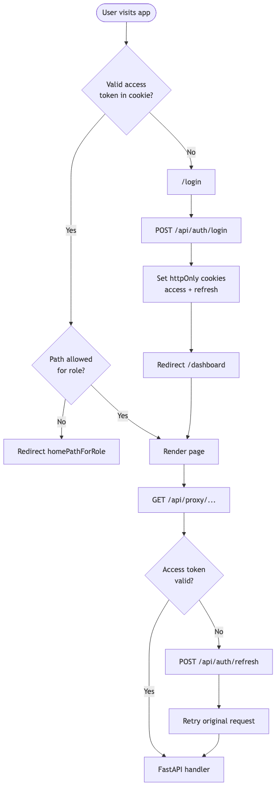

| Step | Component |
| --- | --- |
| Edge guard | `frontend/proxy.ts` |
| Cookie config | `frontend/lib/auth-cookies.ts` |
| BFF proxy | `frontend/app/api/proxy/[...path]/route.ts` |
| Token issue | `backend/app/routers/auth.py` |

---

## 2. Weekly schedule lifecycle

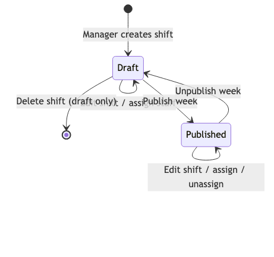

### 2.1 Create and assign flow

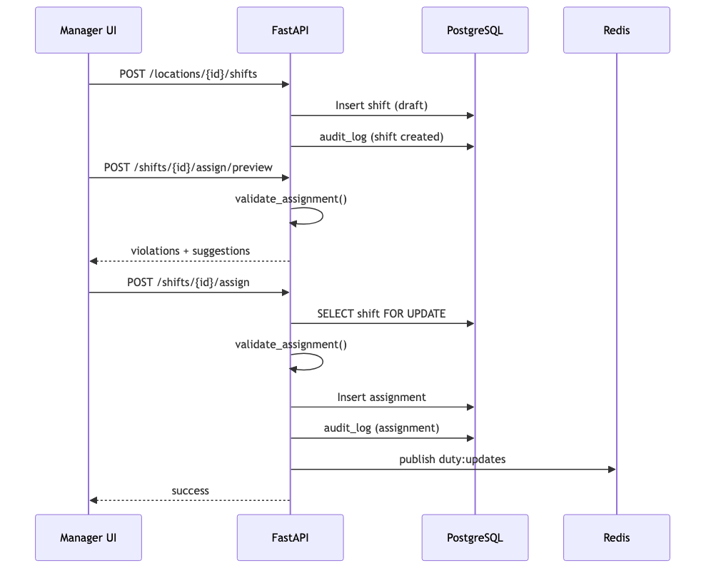

### 2.2 Publish week

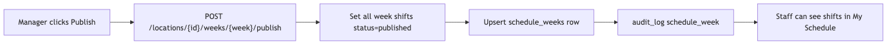

**Constraint on published shifts:** Assignments within `schedule_cutoff_hours` (default 48) require admin role unless override.

---

## 3. Assignment validation

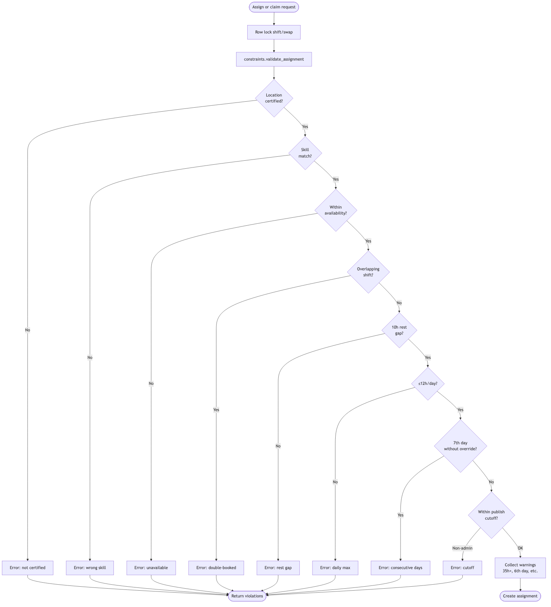

**File:** `backend/app/services/constraints.py`

Warnings do not block assignment. Errors return HTTP 200 with `success: false` on preview, or prevent commit on assign/claim.

---

## 4. Swap and drop workflows

### 4.1 Peer swap

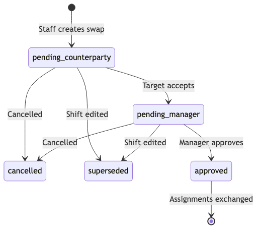

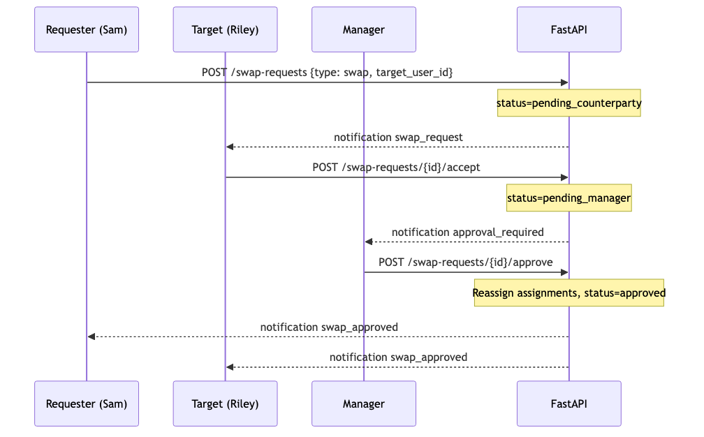

### 4.2 Drop to open pool

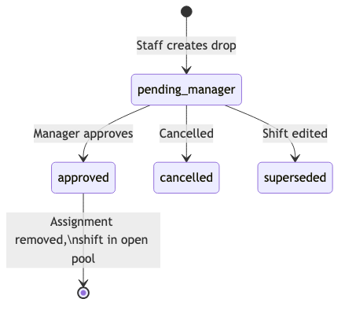

### 4.3 Claim open shift

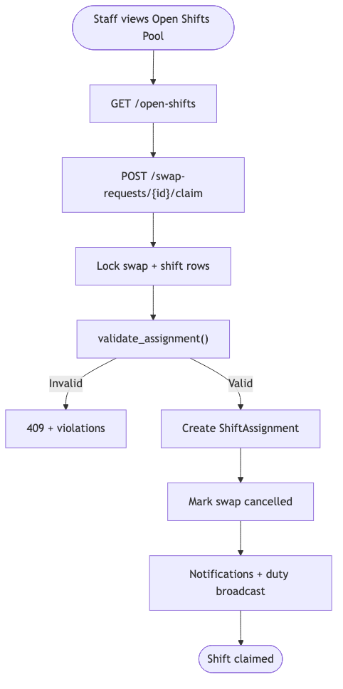

**Frontend:** `OpenShiftsView.tsx` — tabs for pool and activity; 30s polling.

---

## 5. Live floor and clock-in

### 5.1 Duty status determination

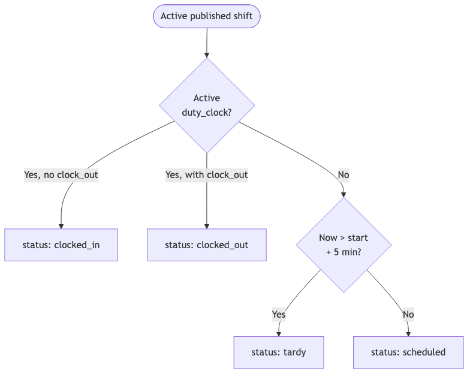

Constants in `backend/app/services/duty.py`:

| Constant | Value |
| --- | --- |
| `TARDY_GRACE_MINUTES` | 5 |
| `EARLY_CLOCK_IN_MINUTES` | 15 |
| `BREAK_AFTER_HOURS` | 4 |

### 5.2 Clock-in flow (staff)

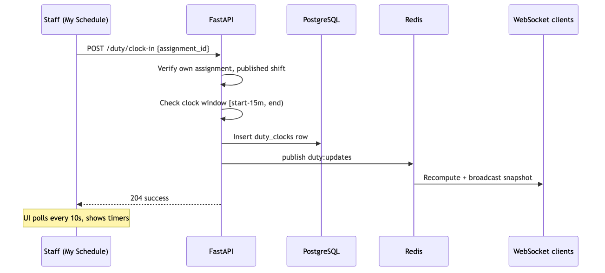

### 5.3 Live floor WebSocket (manager)

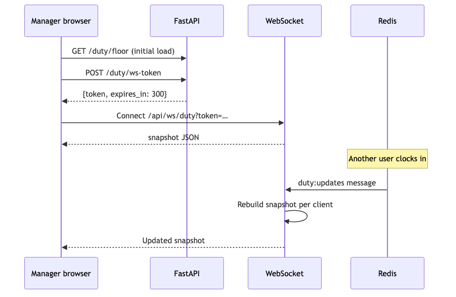

**Frontend hook:** `useDutyFloor.ts`  
**Manager UI:** `OnDutyView.tsx`

---

## 6. Audit logging

### 6.1 Write path

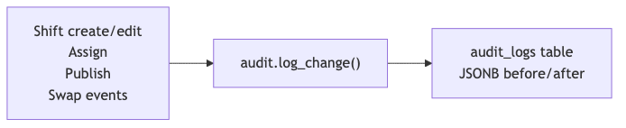

### 6.2 Read paths

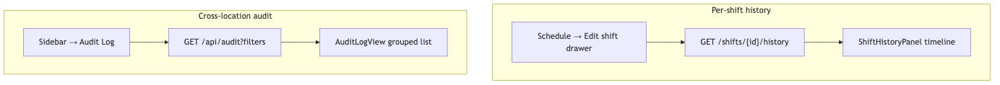

| Filter | Values |
| --- | --- |
| `location_id` | UUID (optional) |
| `entity_type` | shift, assignment, swap_request, schedule_week |
| `limit` | 1–200 (default 100) |

**Scoping:** Managers see logs for accessible locations only. Admins see all.

---

## 7. Dashboard drill-down

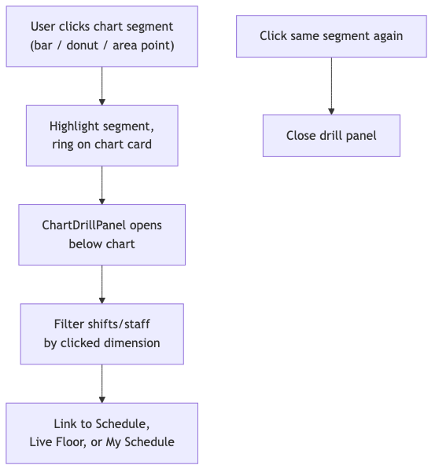

| Dashboard | Chart | Drill shows |
| --- | --- | --- |
| Staff | My hours by day | Shifts on that weekday |
| Manager | Shifts by day | Shifts on that weekday at location |
| Manager | Staff hours | Staff member detail |
| Manager | Live coverage | Clocked-in / tardy staff or gap shifts |
| Manager | Role mix | Shifts for that skill |
| Admin | Open slots by location | Shifts with unfilled headcount |
| Admin | Live workforce | Network coverage breakdown |
| Admin | Shifts by location | All shifts at site |

**Files:** `DashboardView.tsx`, `lib/chart-drill.ts`, `components/charts/ChartDrillPanel.tsx`

---

## 8. Notification flow

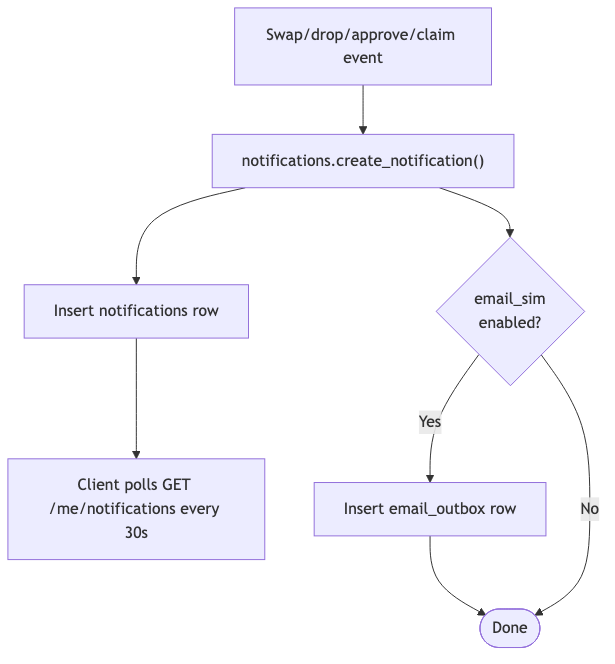

Notification types include: `swap_request`, `swap_accepted`, `drop_request`, `drop_approved`, `swap_approved`, `shift_claimed`, `approval_required`.

---

## 9. End-to-end: manager morning routine

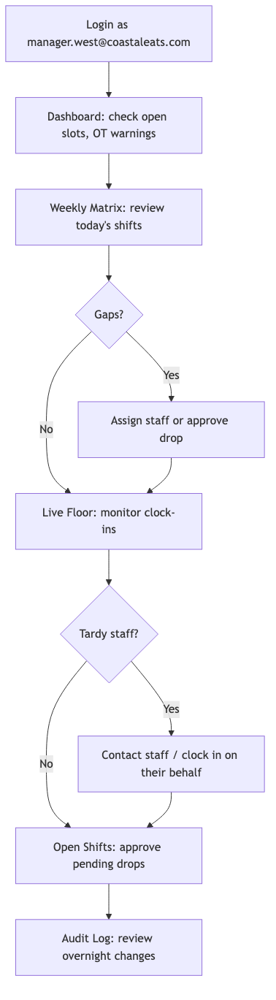

This workflow uses routes `/dashboard` → `/schedule` → `/on-duty` → `/open-shifts` → `/audit`.
